# Final Proyek Web Programming 2
<ul>
  <li>Mata Kuliah: Web Programming 2</li>
  <li>Dosen Pengampu: <a href="https://github.com/Muhammad-Ikhwan-Fathulloh">Muhammad Ikhwan Fathulloh</a></li>
</ul>

## Kelompok
<ul>
  <li>Kelompok: 3</li>
  <li>Proyek: Sistem Kursus</li>
  <li>Anggota:</li>
  <ul>
    <li>Ketua: <a href="https://github.com/deaaamln">Dea Meilani</a></li>
    <li>Anggota 1: <a href="https://github.com/Ginadf21">Gina Deisri Fadila</a></li>
  </ul>
</ul>

## Sistem Kursus 
Dashboard ini menampilkan kursus-kursus tren dan rekomendasi untuk pengguna. Bagian utama menyoroti kursus populer dengan detail singkat dan tombol pendaftaran, sementara bagian bawah menampilkan berbagai kategori kursus lain. Desainnya sederhana, memudahkan pengguna menemukan dan mendaftar kursus.
### Beranda atau Dashboard

    

    

## Penjelasan Proyek
### Apa itu Sistem Kursus Online?
Sistem Kursus Online ini adalah platform yang dirancang untuk memudahkan Anda dalam mempelajari keterampilan baru secara online. Apakah Anda ingin belajar desain grafis dengan Adobe Illustrator dan Adobe Photoshop, mendesain antarmuka pengguna (UI Design), atau bahkan memulai perjalanan dalam pemrograman web dan mobile, platform ini menyediakan berbagai kursus yang sesuai dengan kebutuhan Anda.

### Fitur Utama Platform

1. **Pendaftaran Pengguna yang Mudah:**
   - Daftar dengan mudah menggunakan formulir pendaftaran yang sederhana.
   - Anda hanya perlu mengisi informasi dasar seperti nama, email, dan kata sandi.

2. **Temukan Detail Kursus dengan Mudah:**
   - Temukan kursus yang ingin Anda ikuti, seperti Adobe Illustrator, Adobe Photoshop, UI Design, Web Programming, atau Mobile Programming.
   - Setiap kursus memiliki deskripsi lengkap, jadwal kelas, dan informasi tentang instruktur.

3. **Pembelian Kursus yang Aman dan Mudah:**
   - Lakukan transaksi pembelian kursus dengan aman menggunakan sistem pembayaran yang terpercaya.
   - Pastikan untuk login terlebih dahulu sebelum membeli kursus favorit Anda.

4. **Pelajari dengan Flexibilitas:**
   - Akses materi kursus kapan saja dan di mana saja sesuai kenyamanan Anda.
   - Pelajari dari tutorial dan latihan yang dirancang untuk memudahkan pemahaman.

5. **Monitor Kemajuan Anda:**
   - Pantau kemajuan Anda dengan riwayat kursus yang tercatat.
   - Lihat kursus apa saja yang telah Anda ikuti dan selesaikan.

### Tampilan Antarmuka
Tampilan antarmuka untuk proyek ini diambil dari [Community Figma](https://www.figma.com/design/PclKNEZRiPL3zcJPz3UBjc/MyCourses.io---Course-Website-%7C-Course-Online-%7C-Course-details-%7C-Course-landing-page-%7C-Untitled-UI-(Community)?node-id=451-0&t=4Oj3Xy2y1QtqHc4Z-0). Desain ini menyediakan berbagai elemen UI yang modern dan user-friendly untuk memastikan pengalaman pengguna yang optimal.

## Komponen Proyek
1. **Pendaftaran Pengguna:**
   - **Frontend:**
     - Desain antarmuka pengguna untuk halaman pendaftaran menggunakan HTML dan Tailwind CSS.
   - **Backend:**
     - Implementasi tabel pengguna di database menggunakan MySQL.
     - Pengembangan logika registrasi dan validasi data pendaftaran menggunakan PHP (Laravel).
     - Implementasi controller untuk pendaftaran pengguna.

2. **Login dan Otentikasi:**
   - **Frontend:**
     - Desain antarmuka pengguna untuk halaman login menggunakan HTML dan Tailwind CSS.
   - **Backend:**
     - Pengembangan logika otentikasi pengguna menggunakan PHP (Laravel).
     - Implementasi fitur sesi pengguna untuk menjaga keamanan.
     - Implementasi controller untuk login dan otentikasi pengguna.

3. **Transaksi:**
   - **Frontend:**
     - Desain antarmuka untuk transaksi kursus menggunakan HTML dan Tailwind CSS.
   - **Backend:**
     - Pengembangan logika transaksi, termasuk proses pembelian kursus dan validasi pembayaran menggunakan PHP (Laravel).
     - Implementasi controller untuk mengelola transaksi.

4. **Riwayat Kursus:**
   - **Frontend:**
     - Desain antarmuka untuk menampilkan riwayat kursus yang telah diikuti oleh pengguna menggunakan HTML dan Tailwind CSS.
   - **Backend:**
     - Pengembangan logika untuk menampilkan data riwayat kursus dari database menggunakan PHP (Laravel).
     - Implementasi controller untuk mengelola riwayat kursus.

5. **Detail Kursus:**
   - **Frontend:**
     - Desain antarmuka detail kursus menggunakan HTML dan Tailwind CSS.
   - **Backend:**
     - Desain dan implementasi tabel kursus di database menggunakan MySQL.
     - Pengembangan logika CRUD (Create, Read, Update, Delete) untuk mengelola data kursus menggunakan PHP (Laravel).
     - Implementasi controller untuk mengelola detail kursus.

6. **Verifikasi Pembelian Kursus:**
   - **Frontend:**
     - Implementasi antarmuka yang memastikan pengguna sudah login sebelum membeli kursus menggunakan HTML dan Tailwind CSS.
   - **Backend:**
     - Pengembangan logika untuk memverifikasi status login pengguna sebelum melakukan transaksi pembelian kursus menggunakan PHP (Laravel).
     - Implementasi controller untuk memverifikasi pembelian kursus.

7. **Fitur Admin:**
   - **Frontend:**
     - Desain dan implementasi antarmuka admin untuk mengelola berbagai aspek sistem menggunakan HTML dan Tailwind CSS.
   - **Backend:**
     - Pengembangan logika admin menggunakan PHP (Laravel) untuk:
       - Mengelola peserta (menambah, mengubah, menghapus peserta).
       - Mengelola pelajaran (menambah, mengubah, menghapus pelajaran).
       - Mengelola jadwal kursus.
       - Mengelola transaksi (melihat dan memvalidasi transaksi).
       - Menampilkan riwayat kursus untuk pengguna.
     - Implementasi controller untuk mengelola fitur-fitur admin.

## Pembagian Tim
#### Teknologi yang Digunakan: 
- HTML
- Tailwind CSS
- JavaScript
- PHP (Laravel)
- MySQL

### Pembagian Tugas Per Fitur:

#### Dea - Frontend dan Backend: 

1. **Pendaftaran Pengguna:**
   - **Frontend:** 
     - Desain antarmuka pengguna untuk halaman pendaftaran menggunakan HTML dan Tailwind CSS.
   - **Backend:** 
     - Implementasi tabel pengguna di database menggunakan MySQL.
     - Pengembangan logika registrasi dan validasi data pendaftaran menggunakan PHP (Laravel).
     - Implementasi controller untuk pendaftaran pengguna.

2. **Login dan Otentikasi:**
   - **Frontend:** 
     - Desain antarmuka pengguna untuk halaman login menggunakan HTML dan Tailwind CSS.
   - **Backend:** 
     - Pengembangan logika otentikasi pengguna menggunakan PHP (Laravel).
     - Implementasi fitur sesi pengguna untuk menjaga keamanan.
     - Implementasi controller untuk login dan otentikasi pengguna.

3. **Transaksi:**
   - **Frontend:** 
     - Desain antarmuka untuk transaksi kursus menggunakan HTML dan Tailwind CSS.
   - **Backend:** 
     - Pengembangan logika transaksi, termasuk proses pembelian kursus dan validasi pembayaran menggunakan PHP (Laravel).
     - Implementasi controller untuk mengelola transaksi.

### Gina - Frontend dan Backend:

1. **Detail Kursus:**
   - **Frontend:** 
     - Desain antarmuka detail kursus menggunakan HTML dan Tailwind CSS.
   - **Backend:** 
     - Desain dan implementasi tabel kursus di database menggunakan MySQL.
     - Pengembangan logika CRUD (Create, Read, Update, Delete) untuk mengelola data kursus menggunakan PHP (Laravel).
     - Implementasi controller untuk mengelola detail kursus.

2. **Riwayat Kursus:**
   - **Frontend:** 
     - Desain antarmuka untuk menampilkan riwayat kursus yang telah diikuti oleh pengguna menggunakan HTML dan Tailwind CSS.
   - **Backend:** 
     - Pengembangan logika untuk menampilkan data riwayat kursus dari database menggunakan PHP (Laravel).
     - Implementasi controller untuk mengelola riwayat kursus.

3. **Fitur Admin:**
   - **Frontend:** 
     - Desain dan implementasi antarmuka admin untuk mengelola berbagai aspek sistem menggunakan HTML dan Tailwind CSS.
   - **Backend:** 
     - Pengembangan logika admin menggunakan PHP (Laravel) untuk:
       - Mengelola peserta (menambah, mengubah, menghapus peserta).
       - Mengelola pelajaran (menambah, mengubah, menghapus pelajaran).
       - Mengelola jadwal kursus.
       - Mengelola transaksi (melihat dan memvalidasi transaksi).
       - Menampilkan riwayat kursus untuk pengguna.
     - Implementasi controller untuk mengelola fitur-fitur admin.

## Demo Proyek
<ul>
  <li>Github: <a href="">Github</a></li>
  <li>Youtube: <a href="https://youtu.be/kAoI5SIi1kU">Youtube</a></li>
</ul>

## Penjelasan Kode 

    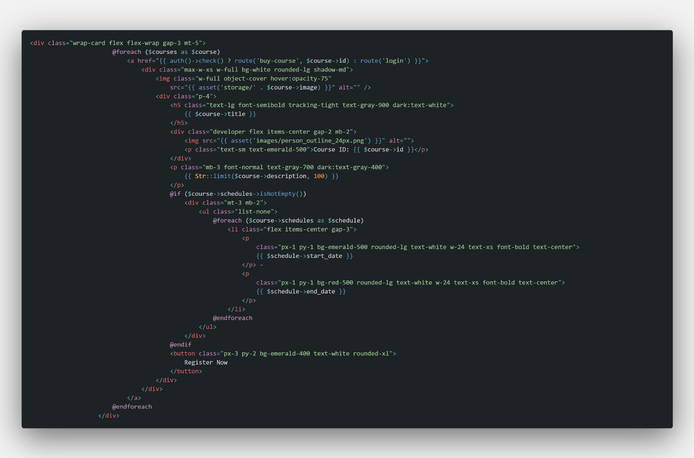

### Beranda atau Dashboard

Ini merupakan tampilan untuk menampilkan course yang di buat oleh admin, yang dimana ketika menekan tag a maka dan apabila sudah login maka akan di arahkan ke memberli course, namun jika belum akan di arahkan ke halaman login untuk login terlebih dahulu.

### Halaman login dan Register

Untuk Authentication Login dan Register menggunakan fitur atau package dari laravel sendiri yaitu laravel breeze yang otomatis sudah terdapat untuk login ketika memasukan username dan password serta masih menggunakan tampilan dari laravel breeze sendiri. 

    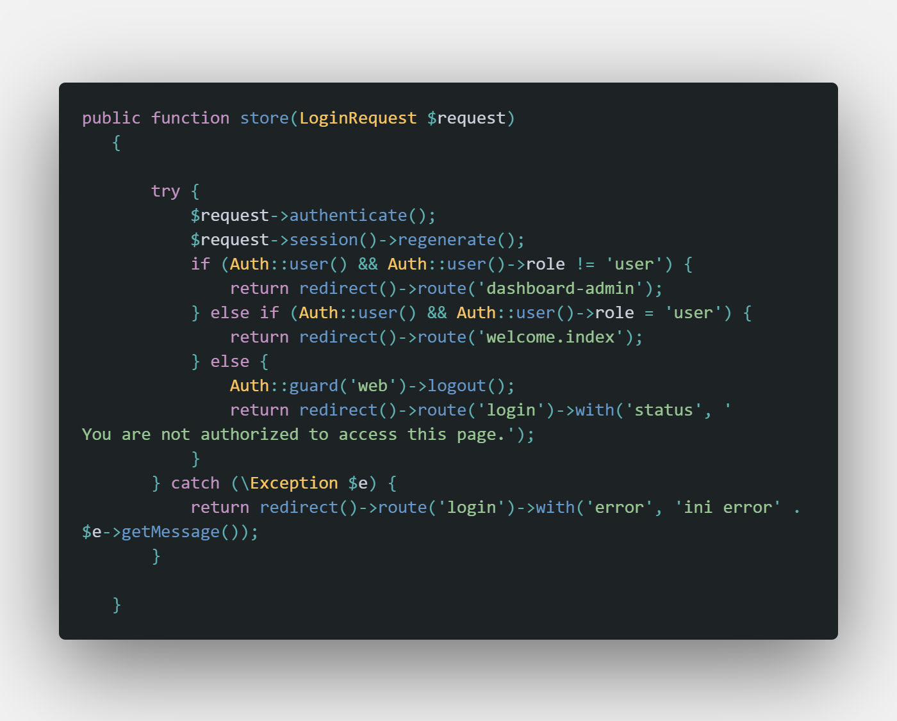

Namun ada beberapa yang kami edit agar bisa memberikan tampilan berdasarkan role antara admin dan user , kami melakukan ketika role bukan user maka akan di arahken ke dashboard-admin namun jika role user maka akan di arahkan ke welcome.index (dashboard user)

    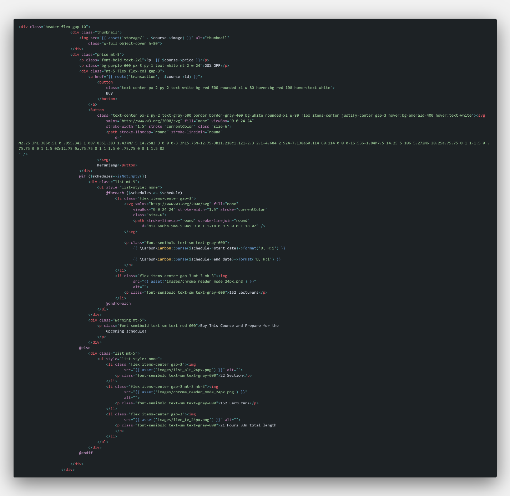

### Detail Course 

Di detail course akan menampilkan data course secara detail mulai dari harga deskripsi dan juga judul dalam 1 halaman untuk 1course dan ketika menekan tombol buy akan di arahkan untuk transaksi. 

    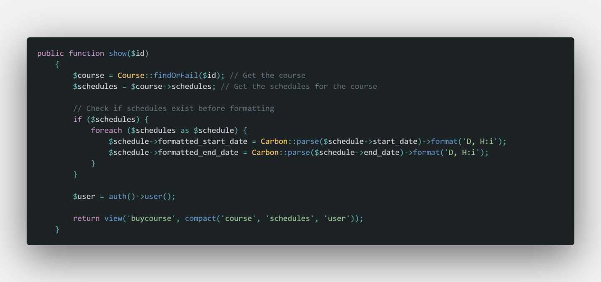

Untuk controllernya kami mengambil data dari Table Course yang berelasi dengan table schedules untuk mendapatkan data nya apakah terdapat jadwal atau tanpa jadwal. 

    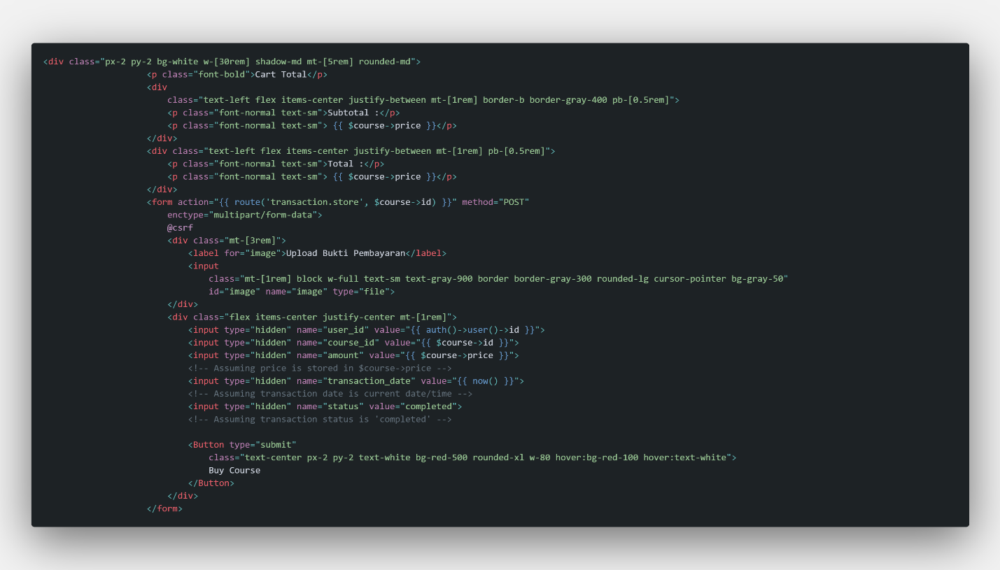

### Transaction 

Transaction akan menampilkan data course yang ingin di beli dengan mengambil data berdasarkan id seperti detail course dan akan di beri tahu total yang harus di bayar oleh user.

    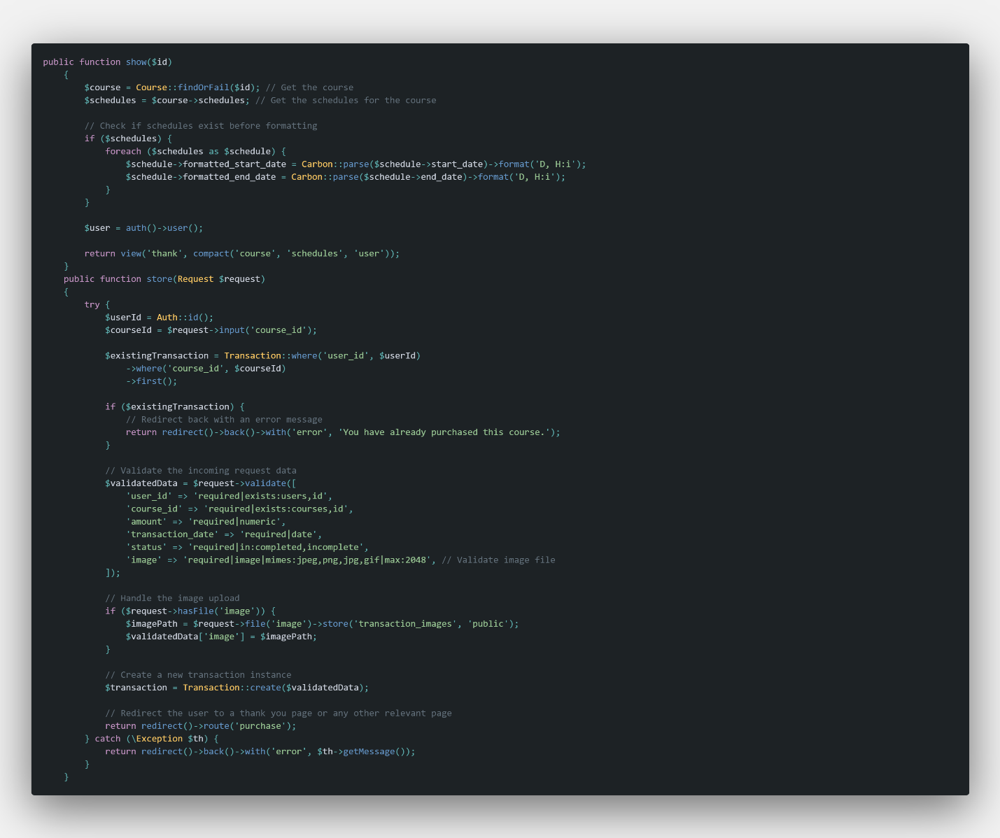

Transaction controller melakukan validasi jika bukti pembayaran belum di upload maka tidak dapat di beli dan akan memunculkan error dan juga beberapa balidasi seperi hanya jpeg png jpg jika extensi image bukan salah satu maka transaksi tidak dapat di proses dan ketika course telah di beli maka akan memunculkan notifikasi bahwa course telah beli.

    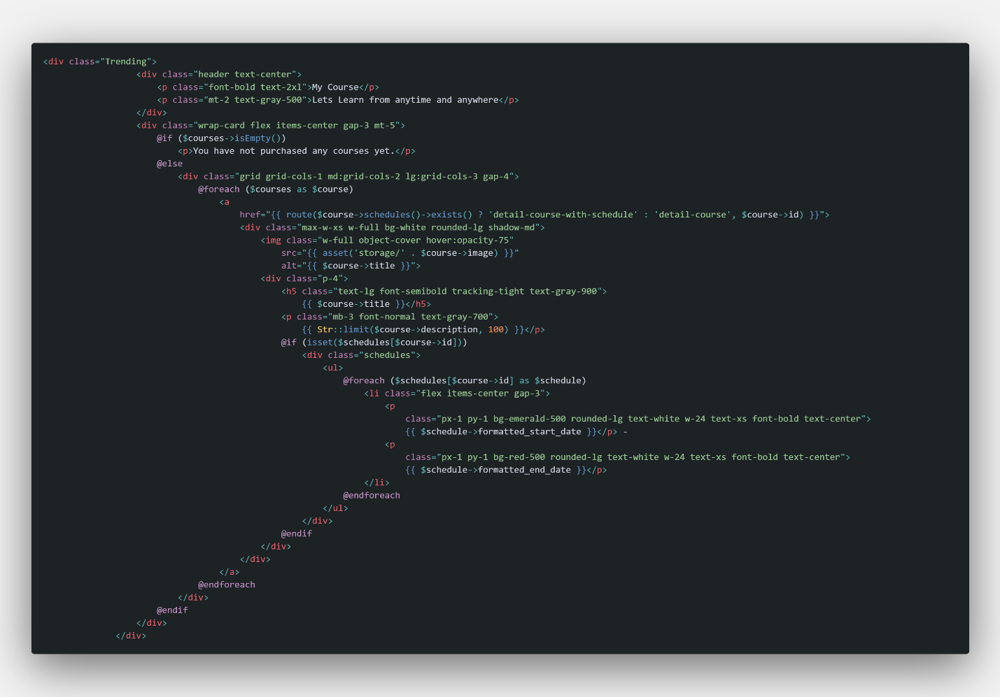

### Course History

Halaman ini akan menampilkan course yang telah di beli oleh user berdasarkan relasi antar table yang di buat antara course, user dan juga transaksi.

    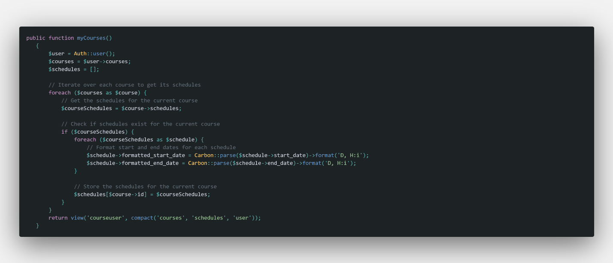

MyCourse merupakan class untuk course history yang mengambil data dari Table User course dan Schedules, untuk menampilkan course berdasarkan pembelian dan juga course akan di tampilkan dengan schedules jika memang terdapat schedule di datalam table Schedule yang berelasi dengan user dan transaksi.

    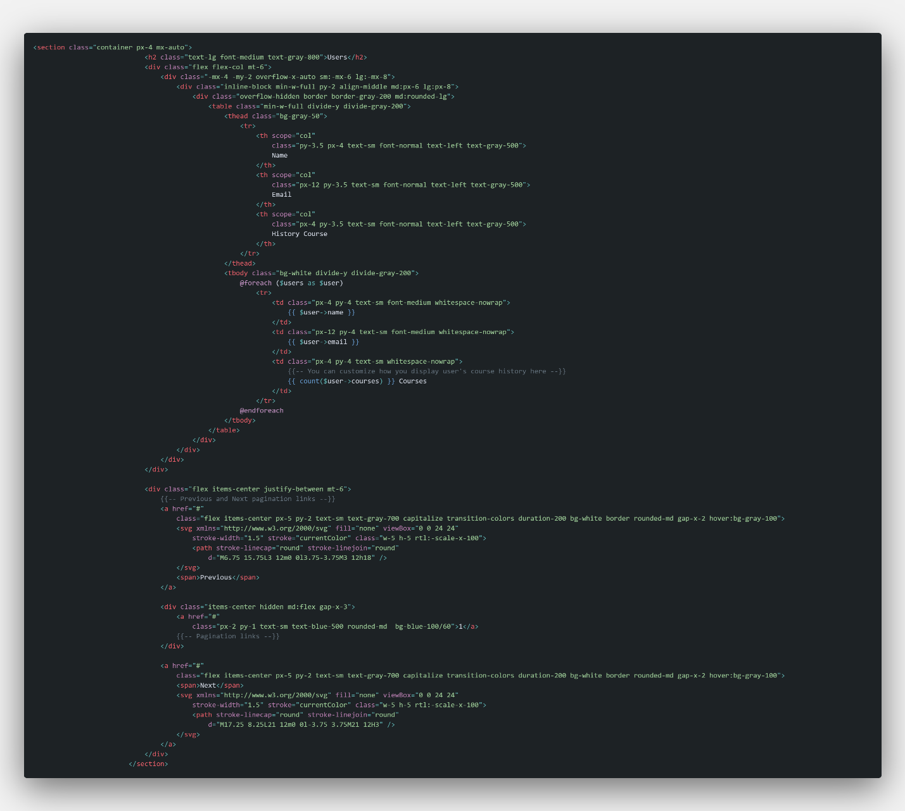

### Dashboard Admin

Halaman ini menampilkan data user dan berapakah course yang telah di beli oleh user.

    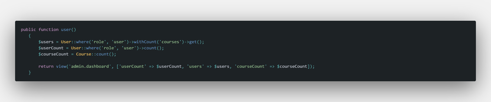

Berikut Controller nya di ambil dari Table User dan juga Course. 

    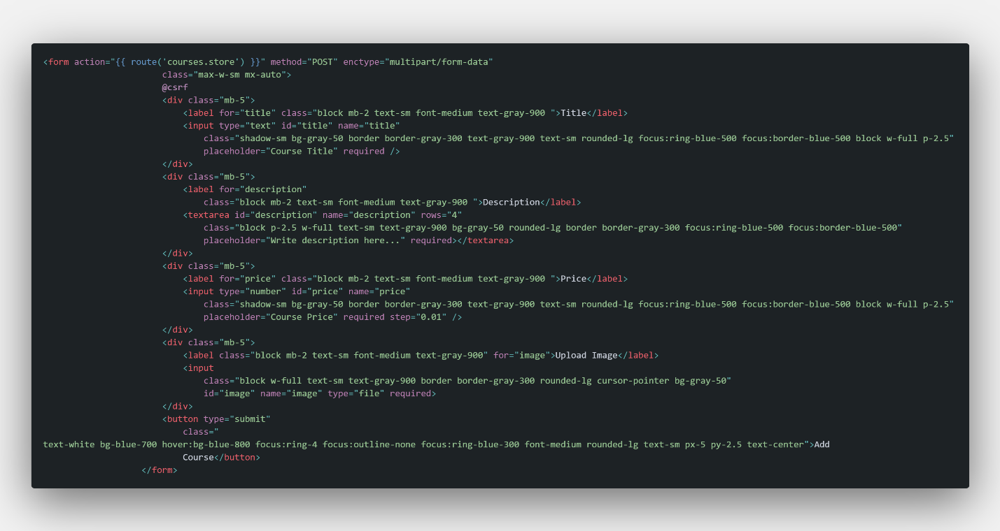

    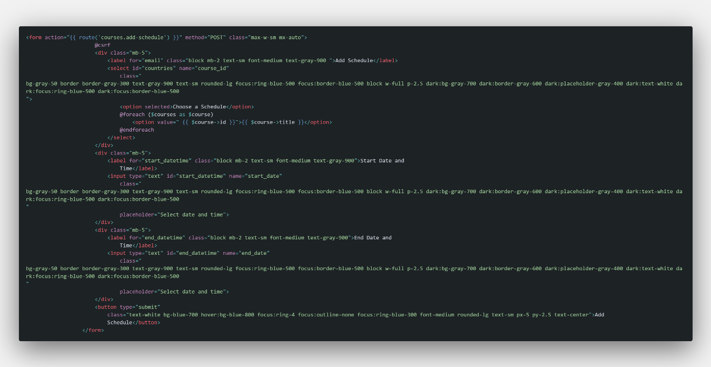

### Add Course Admin

Halaman ini akan menampilkan form untuk menambah Course dan juga Add Schedules.

    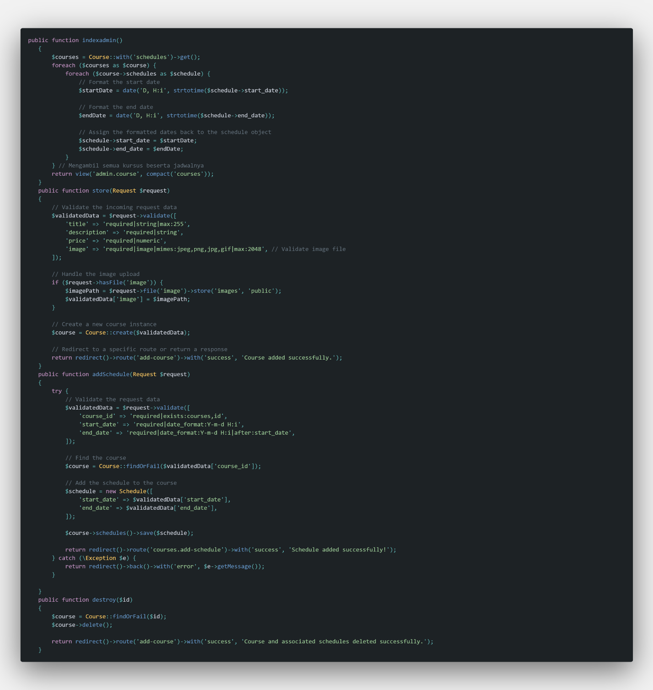

Controller Course yang mencakup semuanya Create Read Update Delete, dan untuk menambahkan add schedule tidak akan bisa di lakukan ketika memang course tidak di buat terlebih dahuu, jadi ketika data course telah tersimpan di database maka dapat menambahkan add schedules. 
